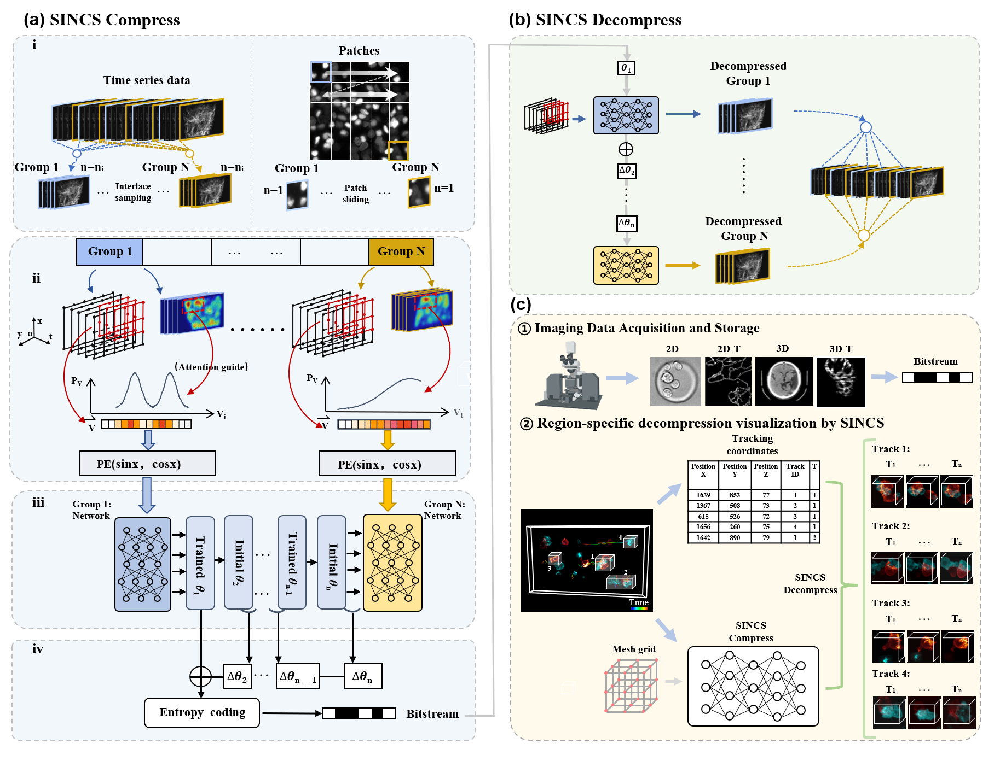
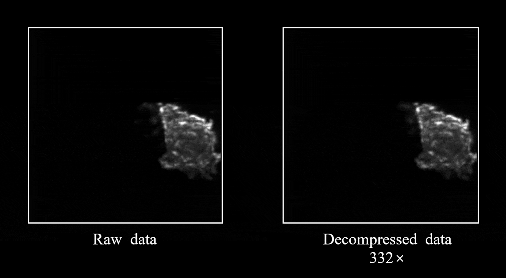

# SINCS 
Compressing arbitrary-dimensional biomedical images using Semantic redundancy-aware implicit neural compression proposed in our paper:(https://www.biorxiv.org/content/10.1101/2023.08.22.554284v2)




## System Requirements

- Windows Server 2022 Datacenter
- Graphics: Nvidia GPU (RTX 4090 recommended)
- Python 3.10.8 (64 bit)
- Intel(R) Xeon(R) Platinum 8375C CPU @ 2.90GHz 


## Installation instructions

- Dependencies installation (using [conda](https://docs.conda.io/en/latest/) for environment installation):
  We provide package list for required environment installation. To use this, run the following commend inside a conda console
  ```
  conda env create -f ./environment/sincs_environment.yml
  ```


## How to use
### Compress data with SINCS
   #### 1. Compress data preparation: ####
  We provide example data for SINCS compression. Please download from [Google Drive](https://drive.google.com/drive/folders/1G6OPIjJ8WmdAnEEpEy0PhEHjCHQ6UQps)
#### Note: If users want to use their own compressed dataset, they can create a separate folder or replace the data in the example data folder. And be careful to change the folder path in the transforms_train.json file.
   #### 2. Network training: ####
Before training SINCS, users need to check whether the installed environment was activated or not. Then, users need to modify the parameters in network configuration files: [SINCS_Compression_3D.cfg](./configs/SINCS_Compression_3D.cfg) and [SINCS_Compression_4D.cfg](./configs/SINCS_Compression_4D.cfg). The detailed descriptions of these main parameters are listed below:
  ```
datadir: Input data path

datatype: Dataset type

netdepth: Layers

netwidth: Channels per layer

N_steps: Number of training steps

size_2D: Vector size be trained one time

step_size: Group numbers

threshold: Threshold for generating saliency maps
  ```
#### Note: The user can control the compression ratio by changing the size of netdepth and netwidth.
Afer entering the baisc parameters, users can train the SINCS model yourself, run:
  ```
  python ./main.py
  ```
The compressed result of each group will be located in : **logs/expname/ image_${i:03d}/ The_Final.tar**
The overall decompression results will be located in : **logs/expname/decompression/**
   #### 3. Weight residual encoding: ####
Furthermore, the user can obtain a larger compression ratio by using residual entropy coding，firstly run：
  ```
  python ./weight_residual_encoding.py
  ```
The residual compressed result of each group will be located in : **logs/expname/ residual/**
and then the upper results can be further compressed using lossless entropy coding such as 7-zip.

The original compressed result of each group will be located in : **logs/expname/ original/**

#### Note:Here we do not provide the use of lossless entropy encoding, the user can choose the appropriate lossless entropy encoding according to the needs of users themselves.

### Example results


